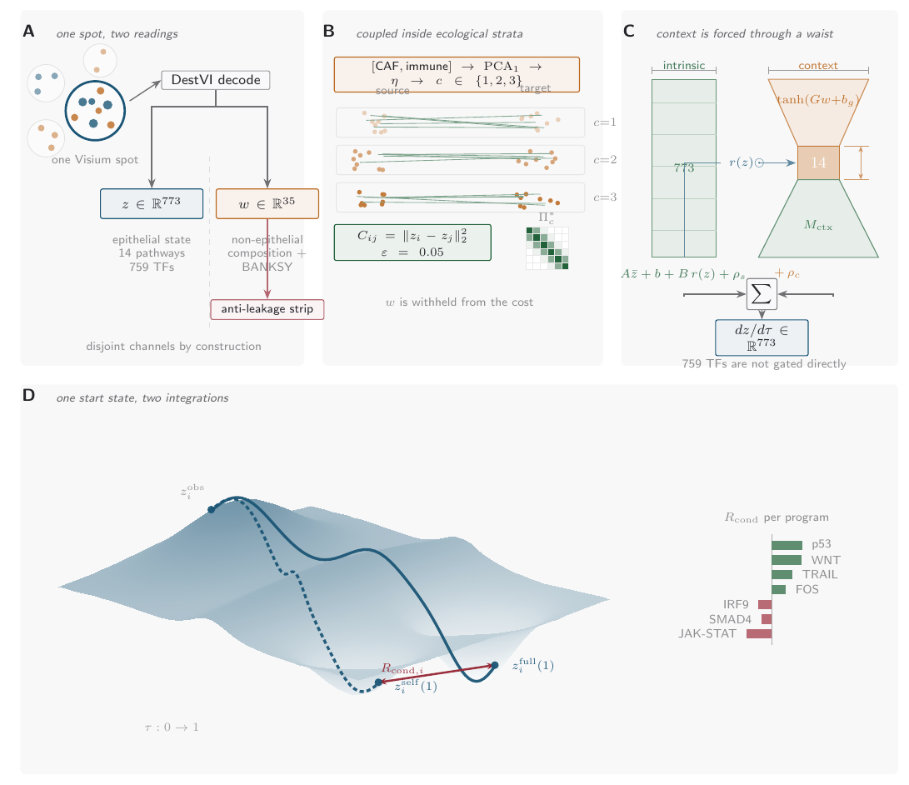

# StageBridge
## StageBridge: Niche-Conditioned Regulatory Transport in Premalignant Epithelial Progression

**M.S. in Bioinformatics thesis, Johns Hopkins University — Krieger School of Arts and Sciences, Advanced Academic Programs. August 2026.**
Author: Abraham J. Book. Advisor: Dr. Chris Bradburne, PhD (Associate Professor, Department of Genetic Medicine, Johns Hopkins University).

<!-- Graphical abstract: PNG rendered from crrt_ude_schematic.pdf for inline GitHub display -->

Premalignant lesions evolve within a tissue ecosystem, yet most spatial analyses read the epithelial
cell in isolation, leaving a systems-level question open: does tissue context carry information about a
cell's progression-aligned regulatory trajectory beyond its own state, and at what spatial scale and
through which programs? This requires not a correlation of niche with state but an estimand that
isolates the *additional* regulatory displacement attributable to context, within ecologically
comparable cells, in mechanistic coordinates. This thesis develops **StageBridge**, a structured
universal differential equation that models premalignant progression as receiver-centered regulatory
transport. It separates an intrinsic progression field from a niche-gated context field and reports
their endpoint difference as a per-program conditional context residual, *R*cond, in named
pathway and transcription-factor coordinates. The transport correspondence is built only from
regulatory-state distance within coarse ecological strata, so ecology is not encoded into the pairing,
and the coupling was selected against a frozen identifiability benchmark that falsified an initial
state-neutral formulation before any real data were analyzed.

Applied to a patient-held-out lung adenocarcinoma precursor atlas, StageBridge recovered a small,
coordinated set of reproducible context residuals — twenty-nine programs on the preinvasive edge,
twenty-eight at invasion — stable in sign across all five folds and under leave-one-donor-out
resampling, forming coherent p53/WNT/TRAIL/AP-1, VEGF-suppressed lineage-reorganizing, and
metabolic–interferon axes. Because each residual is carried in interpretable coordinates, the framework
connects population transport to testable hypotheses: an *R*cond-gated communication analysis
nominated a reciprocal macrophage- and stromal-to-epithelial circuit through LRP1 and EGFR onto the FOS
and RB1 programs.

Critically, the framework also tests the boundary of its own claim. A prespecified falsification ladder
showed that cell-resolved local context was statistically indistinguishable from a
marginal-structure-preserving shuffle of the same features (Δ = 0.08 Sinkhorn units, 95% CI
[−1.10, +1.26]); a variance decomposition attributed this to the ecology's spatial scale, with 85–96% of
the implicated macrophage, fibroblast, and CAF variation residing within specimens rather than tracking
stage. The recoverable signal is therefore specimen-scale, not uniquely receiver-local, at current
spatial resolution. StageBridge thus separates reproducible modeled context structure from the stronger,
unsupported claim that local niche drives progression, turning spatial population transport into a
mechanistically actionable map with a characterized recovery boundary.

### Overview of contents

| Chapter | Contents |
|---|---|
| 1. Introduction | Premalignancy as a tissue-level process; the lung and pancreatic precursor systems; single-cell and spatial profiling; optimal transport and neural differential equations; the unresolved context-residual estimand; objective and three pre-specified hypotheses. |
| 2. StageBridge: Materials and Methods | The structured context-residual UDE (intrinsic + niche-gated fields); the receiver and context representations; conditional-stratified optimal transport; the context residual R_cond; the frozen identifiability screen that selected the coupling; three-stage OT-CFM training; the falsification ladder. |
| 3. Results | Cohort and edge support; estimand selection; the reproducible per-program context residuals; the bounded local-vs-specimen falsification and its ecological explanation; the invasion edge; a stage-GSEA metabolic/interferon reversal; the correctly calibrated PanIN null; regulatory-network and cell--cell-communication corroboration; sensitivity analyses; hypothesis assessment. |
| 4. Discussion and Conclusions | Principal findings; the spatial-scale result as the central inferential contribution; methodological contribution; limitations; future directions; conclusion. |
| Appendices A--C | Entropic OT and Sinkhorn; derivation of the training objective and estimand; extended implementation and supplementary results. |

The model, pipeline, and analysis code are maintained in a companion repository (CRRT-UDE); this
repository contains the written thesis and its figures.

### Building

Built on the Johns Hopkins University dissertation template (see License). Compile with the JHU
template's standard toolchain (`latexmk` with the provided `latexmkrc`, or Overleaf import). The main
file is `00-main.tex`; chapters are `06-chapter-1.tex` (Introduction), `07-chapter-2.tex` (Methods),
`08-chapter-3.tex` (Results), and `09-chapter-4.tex` (Discussion and Conclusions). Template usage
notes are preserved in `TEMPLATE_README.md`.

### License

The thesis document is built on the [JHU Dissertation Template](https://github.com/bibekananda-datta/JHU-Dissertation-Template)
by Bibekananda Datta, used under the [MIT License](LICENSE) (see `LICENSE`, which retains the original
copyright notice as the license requires). The template meets the Johns Hopkins University Sheridan
Library formatting requirements. Thesis content, figures, and results are the author's own work.

### Contact

Abraham J. Book --- [@SecondBook5](https://github.com/SecondBook5) on GitHub.
